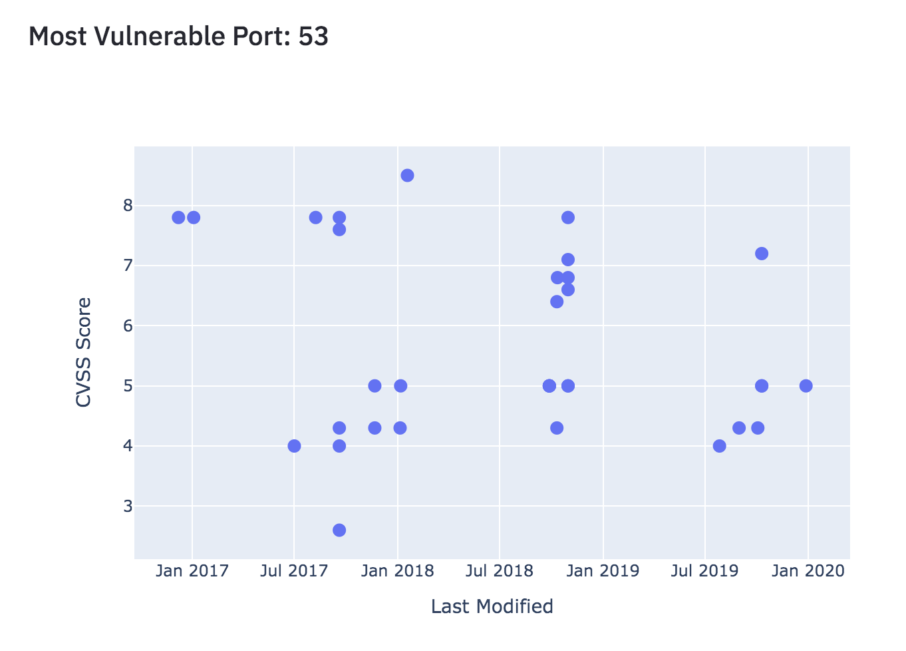

# PyNet Intelligence - User Guide
*Here is a comprehensive guide to get started using PyNet Intel.*

### Prerequisites

Some of the things you'll need before installing PyNet Intelligence are:

* [Python 3.X](https://www.python.org/downloads/) - The programming language I used!
* [PIP](https://pip.pypa.io/en/stable/installing/) - A package manager for python.

### Getting Started

**Clone the Repository**

```
git clone https://github.com/jamie-weiss/PyNet-Intel.git
```

**Install a Virtual Environment Manager (Recommended)**

[virtualenv](https://virtualenv.pypa.io/en/stable/installation.html) (or another tool for creating virtual environments for python)

```
pip install virtualenv
```

**Install Requirements**

First enter the cloned directory.

```
pip install -r requirements.txt
```

**Start the app on localhost**

```
streamlit run app.py
```

The command should automatically open a web browser with the app running.  If it doesnt, open up a new window and type in [localhost:8501](localhost:8501).

### Using PyNet Intelligence

When you first run the app, it should look like this:


Begin by entering an IP address in the input box on the sidebar. Make sure you are authorized to scan this IP address.  Please read the [Policy and Disclaimer](policy.md) section first. If you are unsure if you are authorized, consult the owner of the IP.

The IP I have entered is the IP of a local [Metasploitable](https://information.rapid7.com/download-metasploitable-2017.html) server running on my machine.


Click the **Run Scan** button to begin your system vulnerability scan. There should be a loading bar in the center of the screen.  If you expect to have many vulnerabilities and open ports, please give PyNet some time to run (around 5 mins)


Once the script is finished running. The results page should look similar (but not exactly like) the following screenshots:


Now we will discuss what each section of the page mean...

### The Sidebar

The first thing on the sidebar is the IP address that was just entered.  To run another scan, type a new IP into this field and hit the Run Scan button again.

Next is an interactive map.  In the example shown (or in your example if you are scanning a local server that has a local IP) there will be no location data for the IP.  Any other system that is connected to the internet will have a blue dot at the latitude and longitude coordinates where the system is located. This was discovered using the [Geolocation Scan](pipeline.md#geolocation-scan)


This map is from another scan in which the IP is located in Seattle.

Next we have 3 grey cards that describe some general information about the IP we scanned. 


**Number of Open Ports:** This one is just the number of open ports that were discovered.  More open ports means more places to attack!

**Vulnerability Scores:** Here, we have 2 scores.  They represent the general magnitude of the vulnerabilities discovered in the scans. Each of the vulnerabilities found has a related CVE in which the mappings are described [here](pipeline.md#related-cve-mappings).  The CVEs have a vulnerability score that is used as the 'industry standard' for ranking vulnerabilities. This score is called the CVSS score. The Total score is the sum of all the CVSS scores for all the vulnerabilities found in the system.  The Scaled score represents the Total score divided by the number of vulnerabilities found in the system. Higher scores mean more vulnerable.

**Blacklist IP:** This True/False value represents the results of looking this IP address up on a known database of blacklisted IP addresses.  This does *not* mean that your IP is being watched by the FBI. It only means that it appeared on one of the lists. Often actors will mask their IP addresses when performing malicious acts, this is a common reason for seeing safe IP addresses on blacklists. More information about the blacklist scan can be found [here](pipeline.md#blacklist-ip-check)

### Web Vulnerabilities

Now, in the main section of the app there are some panels describing some of the web-based vulnerability scans run on the system.


**Cross-Site Scripting:** The first thing on the list is a Cross-Site Scripting scan. This is a web vulnerability. If PyNet detected that your server is vulnerable (unlike my example) the output will contain an exploit and a payload. The exploit is the form in which the payload can be injected into to expose this vulnerability.  XSS involves injecting malicious JavaScript code into forms on a website. For more information about how this scan works behind the scenes, check [here](pipeline.md#web-vulnerability-detection).

**Cross-Site Tracing:** Much like the XSS scan, the XST scan also involves injecting malicious JavaScript code into forms. The diagram under the results represents the responses from sending each HTTP method to the server. A 200 response represent an 'OK' connection. Other responses represent [other things](https://developer.mozilla.org/en-US/docs/Web/HTTP/Status).  The XST attack is dependent on the TRACE method giving back a 200 response. For more information about how this scan works behind the scenes, check [here](pipeline.md#web-vulnerability-detection).

**MIME Sniffing:** The MIME Sniffing scan will display the `conent type options` under the vulnerability. This is an HTML setting that we parsed in the backend of the scan.  If options are set to `None`, it is likely the server is vulnerable so we flag it as so. For vulnerabilities like this one it is important to rememember a section of the [disclaimer](policy.md#another-note). For more information about how this scan works behind the scenes, check [here](pipeline.md#web-vulnerability-detection).

**Man in the Middle Attack:** The Man in the Middle Attack scan is another simple scan.  Even if the system is vulnerable, there are no metrics to be printed on the panel. For vulnerabilities like this one it is important to rememember a section of the [disclaimer](policy.md#another-note). For more information about how this scan works behind the scenes, check [here](pipeline.md#web-vulnerability-detection).

### SSH and FTP Vulnerabilities

There are 2 more scans run if the SSH service and FTP service are running in the server.  These two services are ways for a user to log in remotely to their server.  These ports being open always provide some sort of threat, however these ports are often password protected. PyNet runs a password cracking dictionary attack at these ports if they are open.  This means that we send a bunch of commonly used credentials at the service and see if we get a hit.  From doing this there are certain things we can tell. The results look like this:


In this example the SSH credentials were cracked.  The cracked username and passwords are printed below. The FTP port on the other hand was not running.  If the SSH port was not cracked, there would be another piece of information revealed: a security level.  The higher the security level, the more secure the port is.  For more information about these scans and the meaning of security level, read [this](pipeline.md#ssh-and-ftp-security)

### Vulnerability Graphs

Next, we see a graph title Vulnerability by Port. This graph has green dots each of which representing a different port that is open.  The port number is on the X axis, and the Vulnerability score (which was talked about in the [sidebar](#the-sidebar) section) is on the Y axis.  The ports that stand out on the Y axis are those that are more vulnerable. The graph in my example looks like this:


On this graph, port 53 is the most vulnerable and port 80 is the second-most vulnerable. To take a closer look at the most vulnerable ports, we then graph each of the top 2 most vulnerable ports on the next 2 sets of axes.





On these graphs, each dot represents a single vulnerability found in the given port. The X axis represents the date the vulnerability was last modified (newer are in general more important to look at) and the Y axis represents the vulnerability score as usual.  When the points in these graphs are hovered over with the mouse, we get more information about the specific vulnerabilities.


This screenshot shows the information when the highest point in the Port 53 graph is hovered over.  The first two pieces of information are the X and Y axes respectively of the point plotted. Next the CVE ID represents an identification number for that vulnerability in the [MITRE database](https://cve.mitre.org).  Lastly, the service represents the product and version that are currently running on that port and causing that vulnerability. 


